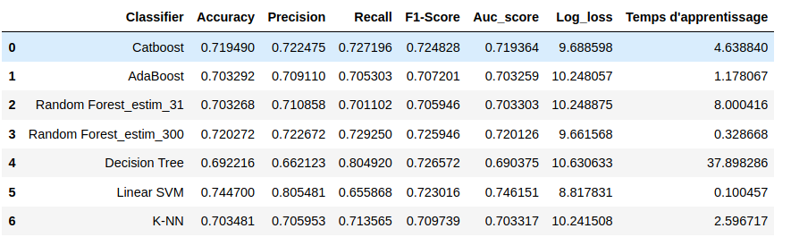
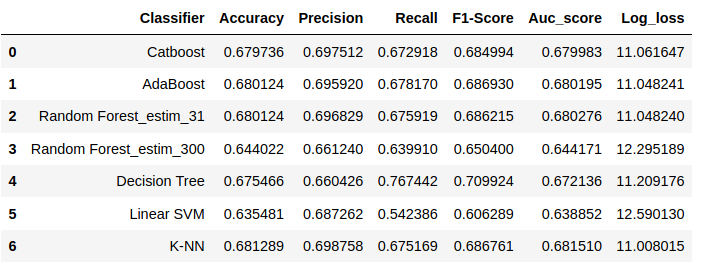

# Tennis Match Prediction :

## Données : 

**[Tennis Betting | Tennis results](http://tennis-data.co.uk/alldata.php)** :

C'est un dataset public regroupant des données sur les match tennis de l'ATP (Association of Tennis Professionals - men only) de 2000-2020, notament :

  * Des données de parainage.
  * Des données sur les résulats des matchs.
  * Des donées sur les conditions des matchs.
  * Autres.

Vous trouvez le schéma détaillé du dataset [ici](http://www.tennis-data.co.uk/notes.txt)

## Objectifs :

* Resoudre les requetes suivantes : 
  
    * Quels sont les trois joueurs ATP avec le plus de victoires ?
    * Combien d'ensemble le joueur "Federer R." gagner au total ?
    * Combien d'ensemble le joueur "Federer R." gagner pendant les années 2016 et 2017 ?
    * Pour chaque match, quel est le pourcentage de victoires du vainqueur dans le passé?

* Proposer un **Pipeline Machine Learning** pour la prédiction des résultats des matchs de l'année 2017.

### Requirements :

* python3
* urllib
* pandas
* numpy
* matplotlib
* sklearn
* keras

## Parties du notebooks :

* Web Scraping et chragement des données .
* Préparation des données : 
    
    * Gestion des entrées défectueses (valeurs erronées).
    * Gestion des valeurs manquantes.

* Feature Engineering (sélection de caractéristiques).
* Modeling.
* Evaluation et comparaison des performances des modèles.
* Debriefing, conclusion et axes d'amélioration.

## Résultats :

### Train (année 2000-2016):

  

### Test (2017) :

  

## Remarques :

* L'impléntation étant proposée en **Pandas**  les traitements se font alors dans le noyeau python, qulques requetes sont donc lentes à excuter. 
* Un chargement des données dans un environnement dsitribué tels que **Pyspark** pourrait fournir des résultats plus rapides.

## Auteur : BARECHE Yassine.

On n'autorise pas la réutilsiation du code fournit, sans demande de permission auprès de son auteur **(barecheyassine@gmail.com)** 